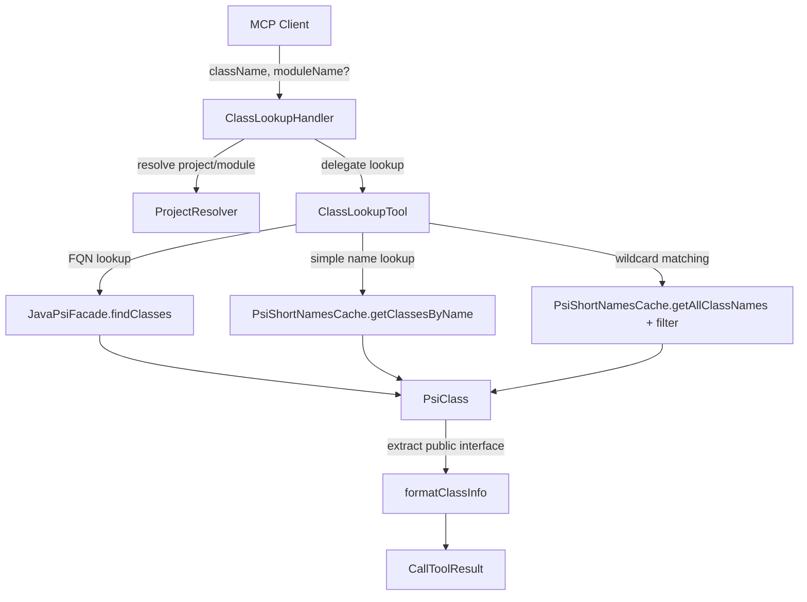

# Design Document: Class Lookup Tool

## Overview

The class-lookup-tool adds a new MCP tool (`lookup_class`) to the IntelliJ plugin that lets callers search for Java/Kotlin classes by name pattern and retrieve their public interface. It follows the same handler pattern established by `RunTestHandler`: a handler class with `@ToolDefinition`/`@Param` annotations, constructor injection for testability, and registration via `ReflectiveToolAdapter`.

The tool accepts three kinds of input patterns:
1. **Fully qualified name** (e.g., `java.util.ArrayList`) — exact FQN lookup via `JavaPsiFacade.findClasses()`
2. **Simple name** (e.g., `ArrayList`) — short-name lookup via `PsiShortNamesCache.getClassesByName()`
3. **Wildcard pattern** (e.g., `Abstract*List`, `java.util.*Map`) — short-name cache enumeration with glob matching against FQNs

Results are capped at a configurable maximum (default 20) and include the fully qualified name, public methods with signatures, public fields with types, implemented interfaces, and superclass.

## Architecture

The feature consists of two main components following the existing separation between handler and tool:



**Design decisions:**

1. **Two-class split (Handler + Tool)**: Mirrors `RunTestHandler` / `RunTestTool`. The handler owns validation, context resolution, and error handling. The tool owns the PSI lookup and formatting logic. This keeps the handler unit-testable without IntelliJ APIs.

2. **Functional dependency injection**: The handler accepts lambdas for context resolution and class lookup, matching the `RunTestHandler` pattern. The tool accepts lambdas for PSI operations (`findClassesByFqn`, `findClassesByShortName`, `getAllClassNames`), enabling tests to inject fakes without a running IDE.

3. **Three-strategy lookup**: The tool detects the pattern type and dispatches to the appropriate IntelliJ API:
   - Contains `.` and no `*` → FQN lookup (`JavaPsiFacade.findClasses`)
   - No `.` and no `*` → simple name lookup (`PsiShortNamesCache.getClassesByName`)
   - Contains `*` → enumerate all short names from cache, expand each to classes, filter FQNs against the glob pattern

4. **DumbService.waitForSmartMode()**: Called before any PSI access to ensure indexes are ready, matching the requirement for dumb-mode handling.

## Components and Interfaces

### ClassLookupHandler

```kotlin
class ClassLookupHandler internal constructor(
    private val contextResolver: (String?) -> ResolvedProject,
    private val classLookup: (Project, String, Int) -> ClassLookupResult
) {
    constructor(projectResolver: ProjectResolver) : this(
        contextResolver = { moduleName -> projectResolver.resolveForLookup(moduleName) },
        classLookup = { project, pattern, maxResults ->
            ClassLookupTool(project).lookup(pattern, maxResults)
        }
    )

    @ToolDefinition(
        name = "lookup_class",
        description = "Looks up Java/Kotlin classes by name pattern and returns their public interface (methods, fields, interfaces, superclass)"
    )
    fun handle(
        @Param(description = "Class name pattern: fully qualified name, simple name, or wildcard pattern using *")
        className: String,
        @Param(description = "IntelliJ module name (optional)")
        moduleName: String?
    ): CallToolResult

    fun registration(): ToolRegistration
}
```

**Note on context resolution**: Unlike `RunTestHandler` which resolves by target class name, the class lookup tool doesn't have a meaningful target to resolve against — the `className` parameter is a search pattern, not a file path. The handler resolves the project/module using only the optional `moduleName` parameter. When `moduleName` is null, it uses the first open project. This requires a simpler resolution path than `RunTestHandler`'s target-based resolution.

### ClassLookupTool

```kotlin
class ClassLookupTool internal constructor(
    private val findClassesByFqn: (String) -> Array<PsiClass>,
    private val findClassesByShortName: (String) -> Array<PsiClass>,
    private val getAllClassNames: () -> Array<String>,
    private val waitForSmartMode: () -> Unit
) {
    constructor(project: Project) : this(
        findClassesByFqn = { fqn ->
            ReadAction.compute<Array<PsiClass>, Exception> {
                JavaPsiFacade.getInstance(project).findClasses(fqn, GlobalSearchScope.allScope(project))
            }
        },
        findClassesByShortName = { name ->
            ReadAction.compute<Array<PsiClass>, Exception> {
                PsiShortNamesCache.getInstance(project).getClassesByName(name, GlobalSearchScope.allScope(project))
            }
        },
        getAllClassNames = {
            ReadAction.compute<Array<String>, Exception> {
                PsiShortNamesCache.getInstance(project).allClassNames
            }
        },
        waitForSmartMode = { DumbService.getInstance(project).waitForSmartMode() }
    )

    fun lookup(pattern: String, maxResults: Int): ClassLookupResult
}
```

### ClassLookupResult

```kotlin
data class ClassLookupResult(
    val classes: List<ClassInfo>,
    val totalMatches: Int,
    val truncated: Boolean
)

data class ClassInfo(
    val fqn: String,
    val methods: List<MethodInfo>,
    val fields: List<FieldInfo>,
    val interfaces: List<String>,
    val superclass: String?
)

data class MethodInfo(
    val name: String,
    val returnType: String,
    val parameters: List<ParameterInfo>
)

data class ParameterInfo(
    val name: String,
    val type: String
)

data class FieldInfo(
    val name: String,
    val type: String
)
```

### ProjectResolver extension

A new method `resolveForLookup(moduleName: String?): ResolvedProject` on `ProjectResolver` (or a standalone function) that:
- When `moduleName` is provided: finds the module across open projects (reusing existing logic)
- When `moduleName` is null: returns the first open project with no specific module

```kotlin
data class ResolvedProject(val project: Project)
```

### Registration

In `CommandProtocolService.initialize()`:

```kotlin
actionRegistry.register(runTestRegistration(ProjectResolver()))
actionRegistry.register(classLookupRegistration(ProjectResolver()))
```

Where `classLookupRegistration` follows the same pattern as `runTestRegistration`:

```kotlin
internal fun classLookupRegistration(projectResolver: ProjectResolver) =
    ClassLookupHandler(projectResolver).registration()
```

## Data Models

### Input

| Parameter    | Type     | Required | Description                                                    |
|-------------|----------|----------|----------------------------------------------------------------|
| `className` | `String` | Yes      | Class name pattern: FQN, simple name, or wildcard with `*`    |
| `moduleName`| `String` | No       | IntelliJ module name for project/module disambiguation         |

### Pattern Detection Logic

```
if pattern contains '*'       → WILDCARD strategy
else if pattern contains '.'  → FQN strategy  
else                          → SIMPLE_NAME strategy
```

### Output Format

The tool returns a text result with one block per matched class:

```
Found 2 matching classes:

=== java.util.ArrayList ===
Superclass: java.util.AbstractList
Interfaces: java.util.List, java.util.RandomAccess, java.lang.Cloneable, java.io.Serializable

Methods:
  boolean add(E e)
  void add(int index, E element)
  E get(int index)
  E set(int index, E element)
  E remove(int index)
  ...

Fields:
  (none)

=== java.util.concurrent.CopyOnWriteArrayList ===
...
```

When results are truncated:
```
Found 20 of 150 matching classes (results truncated):
...
```

### Constants

| Constant              | Value | Description                        |
|-----------------------|-------|------------------------------------|
| `DEFAULT_MAX_RESULTS` | 20    | Default cap on returned classes    |
| `TOOL_NAME`           | `"lookup_class"` | MCP tool name            |


## Key Behaviors

The following behaviors must hold and are validated through case-based unit tests:

1. **Pattern routing**: FQN patterns (containing `.`, no `*`) dispatch to `findClassesByFqn`; simple names (no `.`, no `*`) dispatch to `findClassesByShortName`; wildcard patterns (containing `*`) enumerate all class names and filter by glob. *(Requirements 1.1, 1.2, 1.3, 1.4)*

2. **Public interface completeness**: Formatted output includes FQN, all public methods with signatures, all public fields with types, all implemented interfaces, and superclass (or a no-superclass indicator). *(Requirements 2.1, 2.2, 2.3, 2.4, 2.5)*

3. **Result truncation**: Results contain at most `maxResults` classes. When truncated, the output includes the total match count. *(Requirements 3.1, 3.2)*

4. **Blank input rejection**: Empty or whitespace-only `className` produces an error result. *(Requirement 5.1)*

5. **No-match error echoes pattern**: When no classes match, the error text contains the original pattern. *(Requirement 5.2)*

6. **Error propagation**: Context resolver errors and unexpected exceptions surface in the error result text. *(Requirements 5.3, 5.4)*

## Error Handling

| Scenario                          | Behavior                                                                 |
|-----------------------------------|--------------------------------------------------------------------------|
| Empty/blank `className`           | Return `errorResult("className must not be blank")`                      |
| No classes match pattern          | Return `errorResult("No classes found matching '<pattern>'")`            |
| `ProjectResolver` throws          | Catch `IllegalArgumentException`, return `errorResult(e.message)`        |
| Unexpected exception during lookup| Catch `Exception`, return `errorResult("Tool execution failed: ${e.exceptionSummary()}")` |
| Dumb mode (indexes not ready)     | `DumbService.waitForSmartMode()` blocks until indexes are built          |

Error results use the existing `errorResult()` and `exceptionSummary()` utilities from `ToolResults.kt`.

## Testing Strategy

All tests use JUnit 5, AssertJ, and Kotlin. No property-based testing frameworks. Tests use the internal constructors with injected fakes — no IntelliJ runtime needed.

### ClassLookupToolTest

Tests for the tool's lookup logic, injecting fake lambdas via the internal constructor:

- **FQN pattern dispatches to findClassesByFqn**: `"java.util.List"` calls `findClassesByFqn`, not `findClassesByShortName`
- **Simple name dispatches to findClassesByShortName**: `"ArrayList"` calls `findClassesByShortName`, not `findClassesByFqn`
- **Wildcard pattern filters FQNs by glob**: `"*List"` enumerates all class names and returns only those matching the glob
- **Wildcard with dot filters correctly**: `"java.util.*Map"` matches `java.util.HashMap` but not `java.lang.Map`
- **Results capped at maxResults**: 30 matches with `maxResults=10` returns 10 classes, `truncated=true`, `totalMatches=30`
- **No truncation when under limit**: 5 matches with `maxResults=20` returns all 5, `truncated=false`
- **waitForSmartMode called before PSI access**: verify the call ordering via a tracking fake

### FormatClassLookupResultTest

Tests for the formatting function:

- **Output includes FQN, methods, fields, interfaces, and superclass**: a `ClassInfo` with all fields populated produces output containing each element
- **Absent superclass shows no-superclass indicator**: a `ClassInfo` with `superclass = null` includes the appropriate indicator
- **Empty methods and fields sections render cleanly**: a class with no public methods or fields still formats without errors
- **Truncation message included when truncated**: a `ClassLookupResult` with `truncated=true` and `totalMatches=150` includes the truncation count
- **No truncation message when not truncated**: a non-truncated result omits the truncation message

### ClassLookupHandlerTest

Tests for the handler's validation and error handling, following the `RunTestHandlerTest` pattern:

- **Schema**: registration name is `lookup_class`, `className` is required, `moduleName` is optional
- **Blank className produces error**: empty string and whitespace-only input return `isError=true`
- **No-match error includes the searched pattern**: a pattern with zero results returns error text containing the pattern
- **Context resolution failure surfaces error message**: a throwing context resolver produces an error with the exception message
- **Unexpected lookup exception surfaces error summary**: a throwing lookup function produces an error with the exception summary
- **Successful lookup returns formatted text**: a lookup returning classes produces non-error output with the formatted class info
- **moduleName forwarded to context resolver**: verify the optional module name reaches the resolver

### CommandProtocolServiceTest (addition)

- **Schema JSON contains both run_test and lookup_class**: register both tools and verify the schema output includes both names
