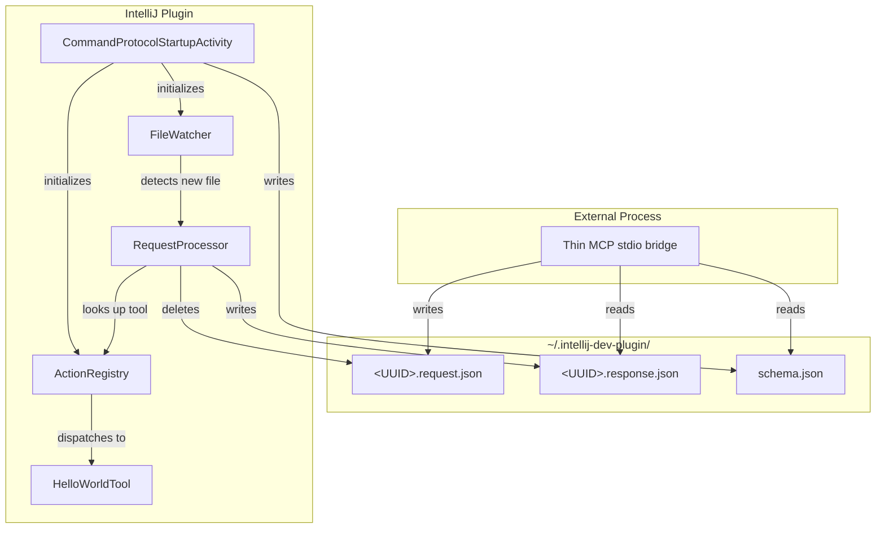

# Design Document: File-Based Command Protocol

## Overview

This design describes the architecture for a file-based command protocol in the DevelopmentMcp IntelliJ plugin. The plugin monitors a well-known directory (`~/.intellij-dev-plugin/`) for JSON request files written by an external thin MCP stdio server. When a request file appears, the plugin parses it, dispatches to the appropriate tool handler, and writes a response file. A schema file advertises available tools.

The key constraint is that IntelliJ's VFS-based `BulkFileListener` does not reliably detect changes in directories outside the project tree. Therefore, the file watcher uses `java.nio.file.WatchService` to receive native filesystem events (`ENTRY_CREATE`) on a dedicated background thread. On JDK 21 (our target), macOS and Linux both provide native implementations (FSEvents/kqueue and inotify respectively), giving near-instant notification latency. To avoid processing partially-written files, the bridge side must write atomically (write to `.tmp`, then rename).

All request/response payloads use MCP SDK types directly (`CallToolRequest`, `CallToolResult`, `ListToolsResult`) from `io.modelcontextprotocol.sdk:mcp:1.1.0`, so the external bridge can pass them through without transformation.

## Architecture



### Lifecycle

1. On project open, `CommandProtocolStartupActivity` (a `ProjectActivity`) runs on a background coroutine.
2. It creates the `CommandProtocolService` (a project-level `@Service`) which:
   - Ensures `~/.intellij-dev-plugin/` exists.
   - Registers the `hello_world` tool in the `ActionRegistry`.
   - Writes `schema.json`.
   - Starts the `FileWatcher` watch loop.
3. All background work is tied to the service's `Disposable` lifecycle. When the project closes, the service is disposed, closing the `WatchService` and interrupting the watch thread, which cancels any in-flight processing.

### Threading Model

| Operation | Thread | Mechanism |
|---|---|---|
| Directory watching | Dedicated daemon thread | `WatchService.take()` blocking loop |
| Initial directory scan | Same daemon thread | `Files.list()` before entering watch loop |
| Request file I/O (read, parse) | Background (pooled) | `ApplicationManager.getApplication().executeOnPooledThread` |
| Tool handler execution | Background (pooled) | Same pooled thread as request processing |
| Tool handler needing IDE model | Background with ReadAction | `ReadAction.run { }` |
| Response file write | Background (same pooled thread) | Atomic write via temp file + rename |
| Schema file write | Background | During initialization |

## Components and Interfaces

### 1. CommandProtocolStartupActivity

A `ProjectActivity` registered in `plugin.xml` as a `<postStartupActivity>`. Entry point that obtains the `CommandProtocolService` and calls `initialize()`.

```kotlin
class CommandProtocolStartupActivity : ProjectActivity {
    override suspend fun execute(project: Project) {
        CommandProtocolService.getInstance(project).initialize()
    }
}
```

### 2. CommandProtocolService

A `@Service(Service.Level.PROJECT)` that owns the lifecycle of all protocol components. Implements `Disposable`.

```kotlin
@Service(Service.Level.PROJECT)
class CommandProtocolService(private val project: Project) : Disposable {
    val actionRegistry: ActionRegistry
    val fileWatcher: FileWatcher
    val requestProcessor: RequestProcessor

    fun initialize() { /* create dir, register tools, write schema, start watcher */ }
    override fun dispose() { /* stop watcher, cancel pending work */ }

    companion object {
        fun getInstance(project: Project): CommandProtocolService = project.service()
    }
}
```

### 3. ActionRegistry

Maintains a `ConcurrentHashMap<String, ToolRegistration>` mapping tool names to their metadata and handlers.

```kotlin
data class ToolRegistration(
    val name: String,
    val description: String,
    val inputSchema: String,       // JSON Schema as a JSON string
    val handler: (Map<String, Any?>) -> CallToolResult
)

class ActionRegistry {
    fun register(tool: ToolRegistration): Boolean
    fun lookup(toolName: String): ToolRegistration?
    fun allTools(): List<ToolRegistration>
}
```

- `register()` returns `false` and logs a warning if the name is already registered.
- `lookup()` returns `null` if no tool matches.
- `allTools()` returns a snapshot for schema generation.

### 4. FileWatcher

Uses `java.nio.file.WatchService` to monitor `~/.intellij-dev-plugin/` for `ENTRY_CREATE` events on a dedicated daemon thread. On startup, performs an initial scan of existing files to pick up any requests that arrived before the watcher started. Filters for files matching `<UUID>.request.json` pattern via regex.

```kotlin
class FileWatcher(
    private val commandDir: Path,
    private val onRequestFile: (Path) -> Unit,
    private val parentDisposable: Disposable
) {
    fun start()   // registers WatchService, scans existing files, enters blocking watch loop on daemon thread
    fun stop()    // closes WatchService (causes take() to throw ClosedWatchServiceException, ending the loop)
}
```

The watch loop:
1. Register `commandDir` with `WatchService` for `ENTRY_CREATE` events.
2. Scan existing `*.request.json` files in the directory and process them.
3. Enter loop: `watchKey = watchService.take()` (blocks until event or close).
4. For each event, check if the filename matches the UUID request pattern.
5. If it matches, invoke `onRequestFile` on a pooled thread.
6. Call `watchKey.reset()` to continue receiving events.
7. On `ClosedWatchServiceException` or `InterruptedException`, exit the loop cleanly.

The watcher also handles `OVERFLOW` events by performing a full directory scan as a fallback.

### 5. RequestProcessor

Reads a request file, parses it as a `CallToolRequest`, dispatches to the `ActionRegistry`, and writes the response.

```kotlin
class RequestProcessor(
    private val actionRegistry: ActionRegistry,
    private val commandDir: Path
) {
    fun process(requestFile: Path)
}
```

Processing steps:
1. Read file content as UTF-8 string.
2. Deserialize JSON to extract `params.name` and `params.arguments` (matching MCP `CallToolRequest` structure).
3. Look up tool in `ActionRegistry`.
4. Invoke handler, catching exceptions.
5. Write `CallToolResult` to `<UUID>.response.json` atomically (write to `.tmp` then rename).
6. Delete the request file.

### 6. HelloWorldTool

A simple tool registered as `hello_world` that returns a greeting.

```kotlin
object HelloWorldTool {
    const val NAME = "hello_world"
    const val DESCRIPTION = "Returns a greeting message"

    fun handle(arguments: Map<String, Any?>): CallToolResult {
        val name = arguments["name"] as? String
        val greeting = if (name != null) "Hello, $name!" else "Hello, World!"
        // Return CallToolResult with text content
    }

    fun registration(): ToolRegistration { /* builds ToolRegistration with JSON Schema */ }
}
```

## Data Models

### Request File Format (MCP `CallToolRequest`)

```json
{
  "method": "tools/call",
  "params": {
    "name": "hello_world",
    "arguments": {
      "name": "Alice"
    }
  }
}
```

Deserialized using MCP SDK's `CallToolRequest` type from `io.modelcontextprotocol.sdk:mcp:1.1.0`. The `method` field is always `"tools/call"`. The `params.name` identifies the tool. The `params.arguments` is a freeform JSON object passed to the handler.

### Response File Format (MCP `CallToolResult`)

Success:
```json
{
  "content": [
    {
      "type": "text",
      "text": "Hello, Alice!"
    }
  ],
  "isError": false
}
```

Error:
```json
{
  "content": [
    {
      "type": "text",
      "text": "Unknown tool: foo_bar"
    }
  ],
  "isError": true
}
```

Serialized using MCP SDK's `CallToolResult` type.

### Schema File Format (MCP `ListToolsResult`)

```json
{
  "tools": [
    {
      "name": "hello_world",
      "description": "Returns a greeting message",
      "inputSchema": {
        "type": "object",
        "properties": {
          "name": {
            "type": "string",
            "description": "Name to greet. If omitted, defaults to 'World'."
          }
        }
      }
    }
  ]
}
```

Serialized using MCP SDK's `ListToolsResult` type.

### File Naming Convention

- Request: `<UUID>.request.json` (e.g., `550e8400-e29b-41d4-a716-446655440000.request.json`)
- Response: `<UUID>.response.json` (same UUID as the corresponding request)
- Schema: `schema.json` (single file, overwritten on tool registration changes)
- Temp files during atomic write: `<UUID>.response.json.tmp`

### Dependency Addition

The `build.gradle.kts` needs the MCP SDK dependency:

```kotlin
dependencies {
    implementation("io.modelcontextprotocol.sdk:mcp:1.1.0")
}
```

The MCP SDK uses Jackson for JSON serialization, so Jackson will be pulled in transitively. The plugin should use the MCP SDK's own serialization utilities (based on Jackson `ObjectMapper`) for all request/response/schema JSON handling to ensure wire-format compatibility.

### UUID Regex Pattern

The file watcher uses this regex to match request files:

```
^[0-9a-fA-F]{8}-[0-9a-fA-F]{4}-[0-9a-fA-F]{4}-[0-9a-fA-F]{4}-[0-9a-fA-F]{12}\.request\.json$
```

### Command Directory Path Resolution

The command directory is resolved as:

```kotlin
val commandDir: Path = Path.of(System.getProperty("user.home"), ".intellij-dev-plugin")
```

This is a fixed, well-known location independent of any project.


## Correctness Properties

*A property is a characteristic or behavior that should hold true across all valid executions of a system — essentially, a formal statement about what the system should do. Properties serve as the bridge between human-readable specifications and machine-verifiable correctness guarantees.*

### Property 1: Directory initialization is idempotent and preserves existing content

*For any* initial state of the command directory (non-existent, empty, or containing arbitrary files), calling the initialization function should result in the directory existing, and any files that were present before initialization should remain unchanged in both name and content.

**Validates: Requirements 1.1, 1.2**

### Property 2: Schema file reflects all registered tools with required fields

*For any* set of tool registrations (each with a name, description, and inputSchema), after all registrations are complete, the schema file should contain a valid `ListToolsResult` JSON with a `tools` array where each registered tool appears exactly once with its `name`, `description`, and `inputSchema` fields present and matching the registration data.

**Validates: Requirements 2.1, 2.2, 2.3**

### Property 3: MCP type serialization round-trip

*For any* valid MCP SDK object (`CallToolRequest`, `CallToolResult`, or `ListToolsResult`), serializing it to JSON and then deserializing the JSON back should produce an object equivalent to the original.

**Validates: Requirements 2.4, 5.1, 5.5**

### Property 4: File watcher ignores non-matching filenames

*For any* filename that does not match the `<UUID>.request.json` pattern (including files with wrong extensions, non-UUID prefixes, response files, or the schema file), the file watcher should not trigger request processing for that file.

**Validates: Requirements 3.3**

### Property 5: Valid request parsing extracts correct tool name and arguments

*For any* valid `CallToolRequest` JSON containing a tool name and an arguments object, the request processor should correctly extract the tool name string and the arguments map matching the original values.

**Validates: Requirements 4.1, 5.1**

### Property 6: Request dispatch invokes the correct handler

*For any* registered tool and any valid request naming that tool, the request processor should invoke exactly the handler associated with that tool name in the action registry, passing the correct arguments.

**Validates: Requirements 4.2**

### Property 7: Successful tool execution produces a correctly-formed response with matching UUID

*For any* request file with a given UUID where the tool handler completes successfully, the response file should: (a) be named `<same-UUID>.response.json`, (b) contain a valid `CallToolResult` with `isError` set to `false`, and (c) include the tool handler's output in the `content` array.

**Validates: Requirements 4.3, 5.2**

### Property 8: Error conditions produce error responses

*For any* request that fails — whether due to invalid JSON, an unknown tool name, or a handler throwing an exception — the request processor should write a response file containing a valid `CallToolResult` with `isError` set to `true` and a `content` array containing a descriptive error message. For handler exceptions, the exception message should appear in the content.

**Validates: Requirements 4.4, 4.5, 4.6, 5.3**

### Property 9: Request file is deleted after processing

*For any* request file processed by the request processor (regardless of whether the tool execution succeeded or failed), the request file should not exist in the command directory after processing completes.

**Validates: Requirements 4.7**

### Property 10: Action registry register-then-lookup round-trip

*For any* tool registration with a unique name, description, inputSchema, and handler, after registering the tool, looking it up by name should return a `ToolRegistration` with matching name, description, and inputSchema. Looking up a name that was never registered should return `null`.

**Validates: Requirements 7.1, 7.3**

### Property 11: Action registry rejects duplicate tool names

*For any* tool name that is already registered, attempting to register another tool with the same name should fail (return `false`), and the original registration should remain unchanged.

**Validates: Requirements 7.2**

### Property 12: HelloWorld tool greeting contains the provided name

*For any* non-null string `name`, invoking the `hello_world` tool with `{"name": name}` should return a `CallToolResult` whose text content contains the provided `name` string.

**Validates: Requirements 6.2**

## Error Handling

### Directory Initialization Errors

- If `~/.intellij-dev-plugin/` cannot be created (e.g., permissions issue), log an error with the path using `Logger.getInstance()` and do not start the file watcher. The plugin remains loaded but non-functional for the command protocol.

### Schema File Write Errors

- If `schema.json` cannot be written, log an error with the file path and the exception cause. The plugin continues operating — tools can still process requests, but the external bridge won't be able to discover tools via the schema.

### Request Processing Errors

All error paths produce a valid `CallToolResult` response with `isError=true`:

| Error Condition | Response Content |
|---|---|
| Invalid JSON in request file | `"Failed to parse request: <parse error message>"` |
| Unknown tool name | `"Unknown tool: <tool_name>"` |
| Handler throws exception | `"Tool execution failed: <exception message>"` |
| Cannot read request file | `"Failed to read request file: <IO error>"` |

### Response Write Errors

- If the response file cannot be written (disk full, permissions), log the error. The request file is still deleted to prevent infinite reprocessing loops.

### File Watcher Errors

- If the watch loop encounters an exception (e.g., directory deleted), log the error and attempt to re-register the watch. On `ClosedWatchServiceException`, exit cleanly (this means `stop()` was called). On `OVERFLOW` events, perform a full directory scan to catch any missed files.

### Atomic Write Failure

- If the temp file write succeeds but the rename fails, attempt to delete the temp file and log the error. This is a rare edge case (e.g., another process holds a lock on the target filename).


## Testing Strategy

### Property-Based Testing

Use **Kotest** (`io.kotest:kotest-property`) as the property-based testing library. Kotest integrates naturally with Kotlin and provides generators (`Arb`) for composing random test data.

Each property test should:
- Run a minimum of 100 iterations
- Reference the design property with a tag comment: `// Feature: file-based-command-protocol, Property N: <title>`
- Use custom `Arb` generators for MCP types, tool registrations, UUIDs, and filenames

### Property Tests (from Correctness Properties)

| Property | Test Approach |
|---|---|
| P1: Directory initialization idempotent | Generate random directory states (exists/not, with/without files), run init, verify directory exists and files preserved |
| P2: Schema reflects registered tools | Generate random lists of ToolRegistrations, register all, verify schema JSON contains all tools with correct fields |
| P3: MCP type round-trip | Generate random CallToolRequest/CallToolResult/ListToolsResult instances, serialize to JSON, deserialize, assert equality |
| P4: Watcher ignores non-matching files | Generate random filenames (non-UUID, wrong extension, etc.), verify watcher filter rejects them |
| P5: Request parsing | Generate random tool names and argument maps, build valid CallToolRequest JSON, parse, verify extracted values match |
| P6: Dispatch correctness | Register random tools with distinct mock handlers, send requests, verify correct handler was called with correct args |
| P7: Successful response format | Generate random tool outputs, process request, verify response UUID matches and CallToolResult is well-formed |
| P8: Error response format | Generate invalid JSON strings, unknown tool names, and exception-throwing handlers, verify error responses |
| P9: Request file deletion | Process random requests (success and failure), verify request file is deleted |
| P10: Registry round-trip | Generate random tool registrations, register, lookup by name, verify match; lookup unregistered names, verify null |
| P11: Duplicate rejection | Register a tool, attempt re-registration with same name, verify failure and original unchanged |
| P12: HelloWorld greeting | Generate random name strings, invoke hello_world, verify output contains the name |

### Unit Tests (Specific Examples and Edge Cases)

- **6.3 (edge case)**: `hello_world` invoked with no `name` argument returns a default greeting (e.g., "Hello, World!")
- **6.4 (example)**: Schema file contains `hello_world` tool with correct inputSchema
- **1.3 (example)**: Simulate unwritable path, verify error log contains the path
- **2.5 (example)**: Simulate unwritable schema path, verify error log contains path and cause
- **3.1 (example)**: After initialization, verify watcher is actively watching
- **3.2 (example)**: Place a request file, verify processing starts promptly
- **3.4 / 8.3 / 8.4 (example)**: After disposal, verify WatchService is closed and no new files are processed
- **5.4 (example)**: Verify response write uses temp file + rename (check no partial file is visible)

### Test Dependencies

```kotlin
// In build.gradle.kts
dependencies {
    testImplementation("io.kotest:kotest-runner-junit5:5.9.1")
    testImplementation("io.kotest:kotest-property:5.9.1")
    testImplementation("io.kotest:kotest-assertions-core:5.9.1")
}

tasks.withType<Test> {
    useJUnitPlatform()
}
```

### Test Configuration

- Property tests: minimum 100 iterations per property (Kotest default is 1000, which is fine)
- Each property test tagged with: `// Feature: file-based-command-protocol, Property N: <title>`
- Unit tests for specific examples, edge cases, and integration scenarios
- Tests should use a temporary directory (via `@TempDir` or `createTempDirectory()`) instead of the real `~/.intellij-dev-plugin/` to avoid side effects
