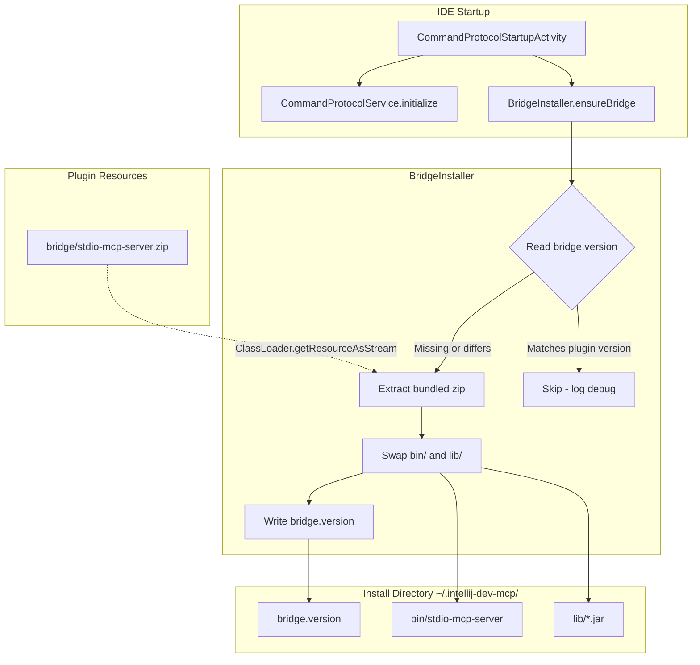

# Design Document: MCP Bridge Auto-Install

## Overview

This feature eliminates the manual bridge installation step by bundling the `stdio-mcp-server` distribution inside the IntelliJ plugin archive and automatically unpacking it into `~/.intellij-dev-mcp/` at IDE startup. The plugin's existing `postStartupActivity` is extended to detect whether the bridge is missing or outdated (via a version marker file), and if so, extract the bundled zip asynchronously. When the bridge is already current, the check completes with a single file read and no extraction occurs.

### Key Design Decisions

1. **Zip-inside-zip bundling**: The bridge distribution zip produced by `:stdio-mcp-server:distZip` is embedded as a plugin resource (`bridge/stdio-mcp-server.zip`). This avoids loose files in the plugin archive and keeps extraction simple — one `ZipInputStream` pass.

2. **Version marker file**: A plain text file `~/.intellij-dev-mcp/bridge.version` stores the SHA-256 hash of the installed bridge zip. This hash is computed at build time from the `distZip` output and bundled as a resource. Comparing it against the installed marker is a single file read — cheaper than checksumming the installed binaries at runtime — and automatically detects any change to bridge code, dependencies, or Kotlin version without manual version bumping.

3. **Async installation**: Bridge extraction runs on a daemon thread so the startup activity returns immediately. The existing `CommandProtocolService.initialize()` proceeds in parallel — the bridge is a separate process that AI clients launch independently, so it doesn't need to be ready before the file protocol starts. Kotlin coroutines are avoided per project conventions; a plain `Thread` (daemon) is used instead, consistent with the existing `RequestLoop` pattern in `CommandProtocolService`.

4. **Atomic replacement**: The installer extracts to a temporary directory first, then swaps `bin/` and `lib/` in one rename sequence. This prevents a partially-extracted bridge from being launched by an AI client during installation.

## Architecture



### Flow

1. `CommandProtocolStartupActivity.execute()` fires on project open.
2. It calls `CommandProtocolService.initialize()` (existing behavior, unchanged).
3. It also launches `BridgeInstaller.ensureBridge()` on a daemon thread.
4. `ensureBridge()` reads `bridge.version` — if it matches the bundled content hash, returns immediately.
5. Otherwise, it loads `bridge/stdio-mcp-server.zip` from the plugin classloader, extracts to a temp dir under `~/.intellij-dev-mcp/`, replaces `bin/` and `lib/`, writes the content hash to the version marker, and logs the result.
6. Errors are caught, logged, and swallowed — the IDE continues normally.

## Components and Interfaces

### BridgeInstaller

The core component responsible for version detection, extraction, and installation. Designed as a standalone class (not an IntelliJ service) so it can be unit-tested without the platform. Version checking and zip extraction are internal implementation details of this class — not separate components — keeping the public surface minimal.

```kotlin
class BridgeInstaller internal constructor(
    private val installDir: Path,
    private val pluginVersion: String,
    private val resourceLoader: (String) -> InputStream?
) {
    constructor() : this(PROTOCOL_DIR, loadBundledVersion(), { BridgeInstaller::class.java.classLoader.getResourceAsStream(it) })

    fun ensureBridge(): Boolean

    companion object {
        const val VERSION_FILE = "bridge.version"
        const val BRIDGE_RESOURCE = "bridge/stdio-mcp-server.zip"
    }
}
```

Constructor parameters:
- `installDir`: The target directory (normally `PROTOCOL_DIR` / `~/.intellij-dev-mcp/`).
- `pluginVersion`: The version string baked into the plugin at build time.
- `resourceLoader`: A function wrapping `javaClass.classLoader.getResourceAsStream()`. Injected for testability — tests can supply in-memory zips.

The `internal` constructor provides the test seam; the public no-arg constructor hardcodes production values. This follows the project convention of `internal` constructors for testability with a clean public API.

### Modified: CommandProtocolStartupActivity

The startup activity gains a call to `BridgeInstaller` on a daemon thread (consistent with the existing `RequestLoop` pattern in `CommandProtocolService`, and avoiding coroutines per project conventions):

```kotlin
class CommandProtocolStartupActivity : ProjectActivity {
    override suspend fun execute(project: Project) {
        Thread {
            BridgeInstaller().ensureBridge()
        }.apply {
            isDaemon = true
            name = "bridge-installer"
            start()
        }
        CommandProtocolService.getInstance().initialize()
    }
}
```

### Build System Changes

The root `build.gradle.kts` is modified to:
1. Declare a dependency on `:stdio-mcp-server:distZip`.
2. Copy the resulting zip into `src/main/resources/bridge/` (or configure the `processResources` task to include it from the build output directory).

```kotlin
// In root build.gradle.kts
tasks {
    processResources {
        from(project(":stdio-mcp-server").tasks.named("distZip")) {
            into("bridge")
            rename { "stdio-mcp-server.zip" }
        }
    }
}
```

### Version String (Content Hash)

The version string is a SHA-256 hash of the bundled `stdio-mcp-server.zip`, computed at build time and written to a resource file (`bridge/bridge-version.txt`). This approach is fully automatic — any change to the bridge code, dependencies, or Kotlin version produces a different hash, triggering reinstallation on next IDE startup. No manual version bumping is needed.

The `loadBundledVersion()` function in `BridgeInstaller`'s public constructor reads this resource at runtime.

```kotlin
// In root build.gradle.kts — generate version hash from bridge zip content
val generateBridgeVersion by tasks.registering {
    val distZip = project(":stdio-mcp-server").tasks.named("distZip")
    dependsOn(distZip)
    val outputDir = layout.buildDirectory.dir("generated/bridge-version")
    outputs.dir(outputDir)
    doLast {
        val zipFile = distZip.get().outputs.files.singleFile
        val hash = java.security.MessageDigest.getInstance("SHA-256")
            .digest(zipFile.readBytes())
            .joinToString("") { "%02x".format(it) }
        val dir = outputDir.get().asFile
        dir.mkdirs()
        dir.resolve("bridge-version.txt").writeText(hash)
    }
}

sourceSets.main {
    resources.srcDir(generateBridgeVersion)
}
```

## Data Models

### Version Marker File

- Path: `~/.intellij-dev-mcp/bridge.version`
- Format: Single line of plain text containing the SHA-256 hex hash of the bundled bridge zip (e.g., `a3f2b8c1d4e5...`)
- Encoding: UTF-8
- No trailing newline required; reader trims whitespace

### Bridge Distribution Zip Structure

The bundled resource `bridge/stdio-mcp-server.zip` mirrors the output of `:stdio-mcp-server:distZip`:

```
stdio-mcp-server.zip
└── stdio-mcp-server/
    ├── bin/
    │   ├── stdio-mcp-server        (Unix shell script)
    │   └── stdio-mcp-server.bat    (Windows batch script)
    └── lib/
        ├── stdio-mcp-server.jar
        ├── protocol-shared.jar
        ├── mcp-1.1.0.jar
        ├── kotlin-stdlib-2.1.20.jar
        └── ... (other dependency JARs)
```

### Install Directory Layout (post-install)

```
~/.intellij-dev-mcp/
├── bridge.version              # SHA-256 hash of bundled bridge zip
├── bin/
│   ├── stdio-mcp-server        # executable (chmod +x on Unix)
│   └── stdio-mcp-server.bat
├── lib/
│   ├── stdio-mcp-server.jar
│   └── ... (dependency JARs)
├── schema.json                 # written by CommandProtocolService (unchanged)
├── *.request.json              # file protocol files (unchanged)
└── *.response.json
```

### Temporary Extraction Directory

During installation, files are extracted to a temp directory before being swapped in:

- Path: `~/.intellij-dev-mcp/.bridge-install-tmp/`
- Cleaned up after successful swap or on failure
- Presence of this directory on next startup indicates a previously failed install — the installer deletes it before proceeding


## Correctness Properties

*A property is a characteristic or behavior that should hold true across all valid executions of a system — essentially, a formal statement about what the system should do. Properties serve as the bridge between human-readable specifications and machine-verifiable correctness guarantees.*

### Property 1: Missing bridge detection

*For any* install directory state where either `bin/stdio-mcp-server` does not exist or the `bridge.version` file does not exist, `BridgeInstaller.ensureBridge()` should return `true` (indicating installation was performed), causing the installer to identify the bridge as needing installation.

**Validates: Requirements 2.1, 2.2**

### Property 2: Outdated version detection

*For any* two version strings `installed` and `expected` where `installed != expected`, `BridgeInstaller.ensureBridge()` should return `true` when the version marker contains `installed` and the plugin version is `expected`.

**Validates: Requirements 3.1**

### Property 3: Installation produces a working bridge

*For any* install directory state where the bridge is missing or outdated, after `BridgeInstaller.ensureBridge()` completes successfully, the install directory must contain `bin/stdio-mcp-server` and at least one JAR in `lib/`, and `ensureBridge()` must return `true`.

**Validates: Requirements 2.3, 3.2**

### Property 4: Extraction preserves all zip entries

*For any* valid bridge distribution zip, after `BridgeExtractor.extractAndInstall()` completes, every file entry in the original zip must exist at the corresponding path under the install directory with identical content.

**Validates: Requirements 4.1, 4.2, 4.3**

### Property 5: Version marker round trip

*For any* version string `V`, after a successful `BridgeInstaller.ensureBridge()` with plugin version `V`, reading the `bridge.version` file from the install directory must return `V`.

**Validates: Requirements 4.5**

### Property 6: Failed installation preserves previous state

*For any* pre-existing install directory state and any simulated I/O failure during extraction, after `BridgeInstaller.ensureBridge()` catches the error, the install directory's `bin/` and `lib/` contents must be identical to their state before the attempted installation (or the partial temp directory must be cleaned up).

**Validates: Requirements 5.3**

### Property 7: Up-to-date bridge skips installation

*For any* version string `V`, when the `bridge.version` file contains `V` and the plugin version is `V` and `bin/stdio-mcp-server` exists, `BridgeInstaller.ensureBridge()` must return `false` and must not modify any files in the install directory.

**Validates: Requirements 6.1, 7.1**

## Error Handling

### Resource Not Found

If `ClassLoader.getResourceAsStream("bridge/stdio-mcp-server.zip")` returns `null`, the `BridgeInstaller` logs a warning via `kotlin-logging` and returns `false`. No exception propagates. This covers the case where the plugin was built without the bridge resource (e.g., during development).

### I/O Errors During Extraction

All extraction happens into a temporary directory (`.bridge-install-tmp/`) before swapping into place. If any `IOException` occurs during:
- Zip reading
- File writing
- Directory creation
- File permission setting

The installer catches the exception, logs the full stack trace at ERROR level, deletes the temp directory if it exists, and returns `false`. The existing `bin/` and `lib/` directories remain untouched.

### Corrupt Zip

If the bundled zip is malformed (truncated, invalid entries), `ZipInputStream` will throw during iteration. This is handled by the same I/O error path above.

### Permission Errors

If the installer cannot write to `~/.intellij-dev-mcp/` (e.g., directory is read-only), the `IOException` is caught and logged. The plugin continues without the bridge.

### Stale Temp Directory

If `.bridge-install-tmp/` exists when the installer starts (indicating a previous failed install), it is deleted before proceeding with extraction.

### Concurrent Access

Multiple IDE instances could race on the install directory. The version marker write uses `Files.writeString` (which is not atomic on all platforms). For this initial implementation, concurrent installs of the same version are benign (same content written). A future improvement could use file locking if needed.

## Testing Strategy

### Unit Tests

All tests use JUnit 5 and AssertJ — no other test or mocking frameworks. Tests use the `internal` constructor of `BridgeInstaller` to inject test seams (install directory, version string, resource loader). Temporary directories use the project convention: `File("build/private/tmp/<TestClassName>").apply { deleteRecursively(); mkdirs() }` — no `@TempDir` annotation.

Unit tests validate each correctness property with well-chosen specific examples and edge cases:

| Property | Test Cases |
|----------|-----------|
| 1: Missing bridge detection | Empty install dir (no binary, no version file); version file present but binary missing; binary present but version file missing |
| 2: Outdated version detection | Version marker contains `abc123`, plugin version is `def456`; marker contains empty string |
| 3: Installation produces working bridge | Fresh install into empty dir; upgrade over existing outdated install |
| 4: Extraction preserves all zip entries | Zip with multiple `bin/` and `lib/` entries; verify each file exists with identical content post-extraction |
| 5: Version marker round trip | After successful install, `bridge.version` file content matches the plugin version string exactly |
| 6: Failed installation preserves previous state | Resource loader that throws `IOException` mid-read; verify existing `bin/` and `lib/` untouched, temp dir cleaned up |
| 7: Up-to-date bridge skips installation | Matching version marker + existing binary; verify `ensureBridge()` returns `false`, no files modified |

Additional edge case tests:
- Null resource loader (bundled zip not found) — skips installation, returns `false`
- Executable permission set on `bin/stdio-mcp-server` after extraction (non-Windows)
- Stale `.bridge-install-tmp/` directory cleaned up before extraction begins

### No Additional Test Dependencies

No additional test frameworks are needed. The existing JUnit 5 + AssertJ dependencies in `build.gradle.kts` are sufficient.
