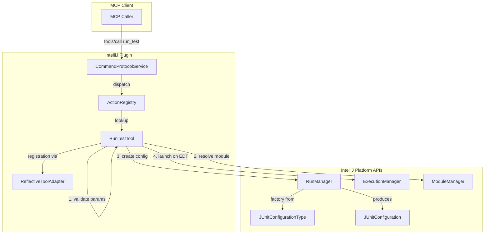

# Design Document: Run Test Tool

## Overview

This design describes the `run_test` MCP tool that allows callers to programmatically launch JUnit tests inside IntelliJ. The tool accepts a test scope (`package`, `class`, or `method`), a target identifier, and an optional module name, then resolves the module — either by name when provided, or via PSI-based autodetection as the default — creates a run configuration via `RunManager`, and launches it through `ExecutionManager`.

The tool follows the established `HelloWorldTool` pattern: a Kotlin class with `@ToolDefinition`/`@Param` annotations on a `handle()` method, a `registration()` method that delegates to `ReflectiveToolAdapter`, and registration in `CommandProtocolService.initialize()`. An internal constructor accepts functional dependencies for testability, while the no-arg constructor wires in real IntelliJ APIs.

Because `RunManager`, `JUnitConfiguration`, and `ExecutionManager` all require the EDT, the tool schedules configuration creation and execution via `ApplicationManager.getApplication().invokeLater()`. The tool itself returns a success result with the run configuration name immediately after scheduling — it does not wait for test completion.

New plugin dependencies on `com.intellij.modules.java`, `com.intellij.java`, and `JUnit` are required in both `build.gradle.kts` and `plugin.xml`.

## Architecture



### Request Flow

1. MCP request arrives with `scope`, `target`, and optional `moduleName`.
2. `RequestProcessor` dispatches to `RunTestTool.handle()` via `ActionRegistry`.
3. `handle()` validates parameters (scope value, target format, non-empty target).
4. On validation failure, returns an error `CallToolResult` immediately.
5. On success, resolves the module (by name if `moduleName` is provided, otherwise via PSI autodetection), invokes the `configCreator` function to build a run configuration, and the `executionLauncher` function to launch it.
6. Returns a success `CallToolResult` with the configuration name.

### Threading Model

| Operation | Thread | Mechanism |
|---|---|---|
| Parameter validation | Request-processing thread | Direct — no platform API needed |
| Module resolution | EDT | Inside `invokeLater` block |
| RunManager config creation | EDT | Inside `invokeLater` block |
| JUnitConfiguration setup | EDT | Inside `invokeLater` block |
| ExecutionManager launch | EDT | Inside `invokeLater` block |
| Return result to caller | Request-processing thread | After scheduling EDT work |

The tool schedules all IntelliJ API work on the EDT via `DumbService.smartInvokeLater` to ensure indexing is complete. The MCP handler returns a success result after scheduling — it does not block waiting for test completion.

## Components and Interfaces

### 1. RunTestTool

The main tool class. Follows the `HelloWorldTool` pattern with constructor injection for testability.

```kotlin
class RunTestTool internal constructor(
    private val configCreator: (Project, ConfigParams) -> RunnerAndConfigurationSettings,
    private val executionLauncher: (Project, RunnerAndConfigurationSettings) -> Unit,
    private val moduleResolver: (Project, String?) -> Module
) {
    constructor(project: Project) : this(
        configCreator = { proj, params -> createJUnitConfig(proj, params) },
        executionLauncher = { proj, settings -> launchConfig(proj, settings) },
        moduleResolver = { proj, name -> resolveModule(proj, name) }
    )

    @ToolDefinition(name = "run_test", description = "Runs JUnit tests in the IDE")
    fun handle(
        @Param(description = "Test scope: package, class, or method") scope: String,
        @Param(description = "Target: package name, class FQN, or class#method") target: String,
        @Param(description = "IntelliJ module name (optional)") moduleName: String?
    ): String { /* validate, create config, launch, return config name */ }

    fun registration() = ReflectiveToolAdapter(this, ::handle).toRegistration()
}
```

### 2. ConfigParams

A data class that captures the validated parameters needed to create a JUnit configuration.

```kotlin
data class ConfigParams(
    val scope: TestScope,
    val target: String,
    val module: Module
)

enum class TestScope(val testObject: String) {
    PACKAGE("package"),
    CLASS("class"),
    METHOD("method")
}
```

### 3. Configuration Creator (default implementation)

A companion/top-level function that creates the `JUnitConfiguration` via `RunManager`:

```kotlin
private fun createJUnitConfig(
    project: Project,
    params: ConfigParams
): RunnerAndConfigurationSettings {
    val runManager = RunManager.getInstance(project)
    val junitType = JUnitConfigurationType.getInstance()
    val factory = junitType.configurationFactories[0]
    val settings = runManager.createConfiguration(configName, factory)
    val config = settings.configuration as JUnitConfiguration

    when (params.scope) {
        TestScope.PACKAGE -> {
            config.persistentData.TEST_OBJECT = JUnitConfiguration.TEST_PACKAGE
            config.persistentData.PACKAGE_NAME = params.target
        }
        TestScope.CLASS -> {
            config.persistentData.TEST_OBJECT = JUnitConfiguration.TEST_CLASS
            config.persistentData.MAIN_CLASS_NAME = params.target
        }
        TestScope.METHOD -> {
            val (className, methodName) = params.target.split("#", limit = 2)
            config.persistentData.TEST_OBJECT = JUnitConfiguration.TEST_METHOD
            config.persistentData.MAIN_CLASS_NAME = className
            config.persistentData.METHOD_NAME = methodName
        }
    }

    config.setModule(params.module)
    settings.isTemporary = true
    runManager.addConfiguration(settings)
    return settings
}
```

### 4. Execution Launcher (default implementation)

```kotlin
private fun launchConfig(
    project: Project,
    settings: RunnerAndConfigurationSettings
) {
    val executor = DefaultRunExecutor.getRunExecutorInstance()
    ProgramRunnerUtil.executeConfiguration(settings, executor)
}
```

### 5. Module Resolver (default implementation)

```kotlin
private fun resolveModule(project: Project, target: String, moduleName: String?): Module {
    val moduleManager = ModuleManager.getInstance(project)

    if (moduleName != null) {
        return moduleManager.findModuleByName(moduleName)
            ?: throw IllegalArgumentException(
                "Module '$moduleName' not found. Available modules: ${availableModuleNames(moduleManager)}"
            )
    }

    return ReadAction.compute<Module, Exception> {
        val facade = JavaPsiFacade.getInstance(project)
        val scope = GlobalSearchScope.projectScope(project)

        val psiElement = facade.findClass(target, scope)
            ?: facade.findPackage(target)
            ?: throw IllegalArgumentException("Could not find '$target' in any module")

        ModuleUtilCore.findModuleForPsiElement(psiElement)
            ?: throw IllegalArgumentException(
                "Found '$target' but could not determine its module. " +
                    "Available modules: ${availableModuleNames(moduleManager)}"
            )
    }
}
```

### 6. CommandProtocolService Changes

Add `RunTestTool` registration alongside `HelloWorldTool`:

```kotlin
fun initialize() {
    // ... existing code ...
    actionRegistry.register(HelloWorldTool().registration())
    actionRegistry.register(RunTestTool(project).registration())
    // ... existing code ...
}
```

### 7. Plugin Dependency Changes

`build.gradle.kts` additions:
```kotlin
intellijPlatform {
    bundledPlugin("com.intellij.java")
    bundledPlugin("JUnit")
}
```

`plugin.xml` additions:
```xml
<depends>com.intellij.modules.java</depends>
<depends>com.intellij.java</depends>
<depends>JUnit</depends>
```

## Data Models

### Tool Input Schema (generated by ReflectiveToolAdapter)

```json
{
  "type": "object",
  "properties": {
    "scope": {
      "type": "string",
      "description": "Test scope: package, class, or method"
    },
    "target": {
      "type": "string",
      "description": "Target: package name, class FQN, or class#method"
    },
    "moduleName": {
      "type": "string",
      "description": "IntelliJ module name (optional)"
    }
  },
  "required": ["scope", "target"]
}
```

Note: `moduleName` is nullable in Kotlin, so `ReflectiveToolAdapter` excludes it from the `required` array automatically.

### Scope-to-JUnitConfiguration Mapping

| scope | TEST_OBJECT | Primary Data Field | target Format |
|---|---|---|---|
| `package` | `TEST_PACKAGE` | `PACKAGE_NAME` | `com.example.tests` |
| `class` | `TEST_CLASS` | `MAIN_CLASS_NAME` | `com.example.MyTest` |
| `method` | `TEST_METHOD` | `MAIN_CLASS_NAME` + `METHOD_NAME` | `com.example.MyTest#testFoo` |

### Success Response

```json
{
  "content": [{ "type": "text", "text": "Launched run configuration: RunTest-MyTest" }],
  "isError": false
}
```

### Error Responses

| Condition | Response Text |
|---|---|
| Invalid scope | `"Invalid scope 'foo'. Must be one of: package, class, method"` |
| Empty target | `"Target must not be empty"` |
| Method scope without `#` | `"Method scope requires target format 'com.example.MyTest#myMethod'"` |
| Module not found (by name) | `"Module '<name>' not found. Available modules: ..."` |
| Module not found (by PSI) | `"Could not find '<target>' in any module"` |
| Execution failure | `"Failed to launch configuration: <reason>"` |


## Correctness Properties

*A property is a characteristic or behavior that should hold true across all valid executions of a system — essentially, a formal statement about what the system should do. Properties serve as the bridge between human-readable specifications and machine-verifiable correctness guarantees.*

### Property 1: Invalid scope produces error

*For any* string that is not one of `"package"`, `"class"`, or `"method"`, invoking `run_test` with that string as the `scope` parameter should return a `CallToolResult` with `isError=true` and content that mentions the valid scope values.

**Validates: Requirements 2.1**

### Property 2: Method scope without hash separator produces error

*For any* string that does not contain the `#` character, invoking `run_test` with `scope="method"` and that string as the `target` should return a `CallToolResult` with `isError=true` and content that describes the expected `class#method` format.

**Validates: Requirements 2.2**

### Property 3: Valid scope and target produce correct configuration parameters

*For any* valid scope (`package`, `class`, or `method`) and corresponding valid target (a non-empty package name for package scope, a non-empty class FQN for class scope, or a non-empty `class#method` string for method scope), the tool should invoke the config creator with parameters where: (a) the `TestScope` matches the input scope, (b) the target string matches the input target, (c) the configuration is marked as temporary, and (d) the module matches the resolved module.

**Validates: Requirements 3.1, 3.2, 3.3, 3.4, 3.5**

### Property 4: Module resolution (explicit name or autodetection)

*When* `moduleName` is provided, the tool should resolve the module by name. *When* `moduleName` is omitted, the tool should autodetect the module via PSI lookup. If the module cannot be resolved by either path, the tool should return a `CallToolResult` with `isError=true` and content that describes the failure.

**Validates: Requirements 3.5**

### Property 5: Valid invocation returns success with configuration name

*For any* valid combination of scope, target, and module, invoking `run_test` should return a `CallToolResult` with `isError=false` and content that contains the name of the launched run configuration.

**Validates: Requirements 4.1, 4.2**

### Property 6: Execution launcher failure produces error with reason

*For any* exception thrown by the execution launcher, invoking `run_test` with valid parameters but a failing launcher should return a `CallToolResult` with `isError=true` and content that contains the exception message.

**Validates: Requirements 4.3**

## Error Handling

### Parameter Validation Errors

All validation errors return a `CallToolResult` with `isError=true` immediately, without touching any IntelliJ APIs:

| Condition | Error Message Pattern |
|---|---|
| Invalid scope value | `"Invalid scope '<value>'. Must be one of: package, class, method"` |
| Empty target | `"Target must not be empty"` |
| Method scope, target missing `#` | `"Method scope requires target format 'com.example.MyTest#myMethod'"` |

### Module Resolution Errors

| Condition | Error Message Pattern |
|---|---|
| Named module not found | `"Module '<name>' not found. Available modules: ..."` |
| PSI target not found | `"Could not find '<target>' in any module"` |

### Execution Errors

| Condition | Error Message Pattern |
|---|---|
| Config creation fails | `"Failed to create run configuration: <exception message>"` |
| Execution launch fails | `"Failed to launch configuration: <exception message>"` |

All error paths produce valid `CallToolResult` objects with descriptive messages. The tool never throws exceptions to the caller — all failures are captured in the result.

### EDT Scheduling

If the tool is invoked while the IDE is in dumb mode (indexing), `DumbService.smartInvokeLater` defers execution until indexing completes. This is transparent to the caller — the tool still returns a success result after scheduling.

## Testing Strategy

### Frameworks

JUnit 5 + AssertJ only. No other test or mocking frameworks. Prefer real objects over mocks — only use Mockito-kotlin when real objects would make the test slow or significantly more complex.

### Test Style

- Test through the public API (`handle()` and `registration()`). Do not expose or test internals.
- Use the `internal` constructor with function/lambda test doubles — no IntelliJ platform needed for unit tests.
- Test names describe the business assertion as a fact, without parasite words (`test`, `should`, `returns`, `handles`, `correct`, `expected`).
- No code comments in tests. Extract helper functions with descriptive names instead.
- Hoist shared objects (tool instance, registration, captured params) to class fields.
- Act-then-assert structure. Anything not in the domain language of the scenario belongs in a helper.

### Unit Tests (`RunTestToolTest`)

| Test Name | What It Verifies | Property |
|---|---|---|
| `registration name is run_test` | `registration().name == "run_test"` | Req 1.3 |
| `scope is required in schema` | `scope` in required array, type string | Req 1.4 |
| `target is required in schema` | `target` in required array, type string | Req 1.5 |
| `moduleName is optional in schema` | `moduleName` present but NOT in required array | Req 1.6 |
| `unrecognized scope produces error listing valid values` | `handle("bogus", "x", null)` → isError, message lists package/class/method | P1 |
| `empty target produces error` | `handle("class", "", null)` → isError, message says target required | Req 2.3 |
| `method scope without hash separator produces error` | `handle("method", "com.Foo", null)` → isError, message describes `class#method` format | P2 |
| `package scope sets PACKAGE_NAME on config` | Capturing configCreator receives `TestScope.PACKAGE` and target as-is | P3 |
| `class scope sets MAIN_CLASS_NAME on config` | Capturing configCreator receives `TestScope.CLASS` and target as-is | P3 |
| `method scope splits target into class and method` | Capturing configCreator receives `TestScope.METHOD` with full `class#method` target | P3 |
| `unknown module name produces error listing available modules` | moduleResolver throws with available names → isError, message contains module names | P4 |
| `successful invocation includes configuration name in result` | Stub configCreator/launcher → isError=false, result contains config name | P5 |
| `execution launcher failure produces error with reason` | Throwing launcher → isError=true, result contains exception message | P6 |
| `injected dependencies are used instead of real APIs` | Construct with lambdas, invoke handle(), verify lambdas were called | Req 6.3 |

### Test Dependencies

No new test dependencies needed — the project already has JUnit 5 and AssertJ. Existing `TestHelpers.kt` utilities (`parseSchema`, `schemaProperty`) are reused for schema assertions.

### Test Configuration

- All tests use the `internal` constructor with lambda test doubles
- The `configCreator` lambda captures `ConfigParams` into a class field for assertion
- The `executionLauncher` lambda is a no-op (or throws for the failure test)
- The `moduleResolver` lambda returns a stub or throws (for the unknown-module test)
