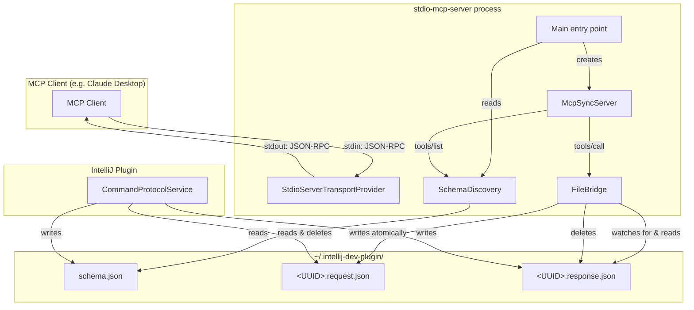

# Design Document: Stdio MCP Server

## Overview

This design describes a standalone CLI application (`stdio-mcp-server`) that bridges the MCP stdio transport to the existing file-based command protocol implemented by the DevelopmentMcp IntelliJ plugin. The CLI reads JSON-RPC messages from stdin, translates `tools/call` requests into file-based request/response exchanges in `~/.intellij-dev-plugin/`, and writes JSON-RPC responses to stdout.

The CLI is a separate Gradle module (`stdio-mcp-server`) with its own `build.gradle.kts` and `main` function. It depends only on the MCP SDK (`io.modelcontextprotocol.sdk:mcp:1.1.0`), Kotlin stdlib, and `kotlin-logging-jvm`. It has zero dependency on IntelliJ Platform APIs.

On startup, the CLI reads `~/.intellij-dev-plugin/schema.json` to discover available tools. It uses the MCP SDK's `McpSyncServer` with `StdioServerTransportProvider` to handle the MCP protocol lifecycle (`initialize`, `initialized`, `tools/list`, `tools/call`). For `tools/call`, it generates a UUID, writes a `<UUID>.request.json` file atomically, waits for the corresponding `<UUID>.response.json` using `WatchService.poll(timeout)` on the calling thread, reads the result, and returns it to the client.

Key design decisions:
- **WatchService.poll(timeout) for response waiting**: Rather than a background watcher thread or busy-polling, each `tools/call` handler registers a `WatchService` on the command directory and calls `poll(timeout)` in a loop on the calling thread. This gives native event notification (inotify/FSEvents on JDK 21) with the simplicity of synchronous code. No background threads needed for watching.
- **MCP SDK server APIs**: The CLI uses `McpSyncServer` (the synchronous variant) because each tool call blocks waiting for a file response anyway. The SDK handles JSON-RPC framing, lifecycle, and transport.
- **Shared ObjectMapper**: Uses `McpJsonDefaults.getMapper()` for all JSON serialization, ensuring wire-format compatibility with the plugin side.

## Architecture



### Startup Sequence

1. `main()` resolves the command directory path (`~/.intellij-dev-plugin/`).
2. `SchemaDiscovery` reads and parses `schema.json` as `ListToolsResult`. If the file is missing or invalid, logs to stderr and exits with code 1.
3. `main()` builds an `McpSyncServer` via `McpServer.sync(transportProvider)`:
   - Registers a `tools/list` handler that returns the parsed tools.
   - For each tool in the schema, registers a `tools/call` handler that delegates to `FileBridge`.
   - Sets server info: name=`"intellij-dev-mcp"`, version=`"1.0.0"`.
4. The MCP SDK's `StdioServerTransportProvider` takes over stdin/stdout, handling JSON-RPC framing.
5. The server blocks until stdin EOF, then shuts down.

### Threading Model

| Operation | Thread | Mechanism |
|---|---|---|
| JSON-RPC read/write | MCP SDK managed | `StdioServerTransportProvider` |
| `tools/list` handling | MCP SDK request thread | Returns the tool list loaded at startup |
| `tools/call` handling | MCP SDK request thread | Blocks on `FileBridge.call()` |
| Response file watching | Same request thread | `WatchService.poll(timeout)` loop |
| Shutdown cleanup | Shutdown hook thread | `server.close()` via `Runtime.addShutdownHook` |

The MCP SDK handles concurrent requests internally. Each `tools/call` blocks its request thread in `FileBridge.call()` waiting for the response file. Since each call uses a distinct UUID, concurrent calls don't interfere.

## Components and Interfaces

### 1. Main (entry point)

The `main` function in the `stdio-mcp-server` module. Orchestrates startup, wires components, and starts the MCP server.

```kotlin
// stdio-mcp-server/src/main/kotlin/com/amazon/rasp/mcpserver/Main.kt
package ca.artemgm.mcpserver

fun main() {
    val commandDir = Path.of(System.getProperty("user.home"), ".intellij-dev-plugin")
    val tools = SchemaDiscovery.loadTools(commandDir)
    val fileBridge = FileBridge(commandDir)
    
    val transportProvider = StdioServerTransportProvider(McpJsonDefaults.getMapper())
    val server = McpServer.sync(transportProvider)
        .serverInfo(Implementation(SERVER_NAME, SERVER_VERSION))
        .capabilities(ServerCapabilities.builder().tools(ToolCapability()).build())
        .tools(tools, fileBridge)
        .build()
    
    Runtime.getRuntime().addShutdownHook(Thread { server.close() })
    server.connect()
}
```

### 2. SchemaDiscovery

Reads and parses `schema.json` from the command directory. Returns the list of `McpSchema.Tool` objects.

```kotlin
object SchemaDiscovery {
    fun loadTools(commandDir: Path): List<McpSchema.Tool>
}
```

- Reads `commandDir/schema.json` as a UTF-8 string.
- Deserializes using `McpJsonDefaults.getMapper()` as `ListToolsResult`.
- Returns `listToolsResult.tools()`.
- If the file doesn't exist: logs error with expected path to stderr, calls `exitProcess(1)`.
- If JSON is invalid: logs parse error to stderr, calls `exitProcess(1)`.

### 3. FileBridge

Handles `tools/call` by writing request files and waiting for response files. This is the core bridge component.

```kotlin
class FileBridge(private val commandDir: Path) {

    fun call(toolName: String, arguments: Map<String, Any?>): CallToolResult
}
```

`call()` flow:
1. Generate a random UUID.
2. Build the request JSON envelope: `{"method":"tools/call","params":{"name":"<toolName>","arguments":{...}}}`.
3. Serialize using `McpJsonDefaults.getMapper()`.
4. Write atomically: write to `<UUID>.request.json.tmp`, then `Files.move(..., ATOMIC_MOVE)` to `<UUID>.request.json`.
5. Wait for `<UUID>.response.json` using `WatchService.poll(timeout)` in a loop (see Response Waiting below).
6. On response file appearance: read content, parse as `CallToolResult`, delete response file, return result.
7. On timeout (120s): throw an exception (the MCP SDK translates this into an error response).

No shutdown method, no pending-request tracking. Each `call()` is self-contained — it writes a file, waits, returns. If the process dies mid-call, the plugin processes the orphaned request harmlessly (the response file just sits there).

### Response Waiting Strategy

Each `tools/call` invocation waits for its response file using `WatchService.poll(timeout)` on the calling thread:

```kotlin
private fun waitForResponse(uuid: String, deadline: Instant): CallToolResult? {
    val responseFilename = "$uuid$RESPONSE_SUFFIX"
    val responsePath = commandDir.resolve(responseFilename)
    
    // Check if response already exists — the plugin may have responded before we started watching
    if (Files.exists(responsePath)) return readResponse(responsePath)
    
    commandDir.fileSystem.newWatchService().use { watchService ->
        commandDir.register(watchService, ENTRY_CREATE)
        
        // Re-check after registration — response may have arrived between the first check and registration
        if (Files.exists(responsePath)) return readResponse(responsePath)
        
        while (Instant.now().isBefore(deadline)) {
            val remaining = Duration.between(Instant.now(), deadline)
            if (remaining.isNegative) break
            
            val key = watchService.poll(remaining.toMillis(), TimeUnit.MILLISECONDS) ?: break
            try {
                for (event in key.pollEvents()) {
                    if (event.kind() == OVERFLOW) {
                        if (Files.exists(responsePath)) return readResponse(responsePath)
                        continue
                    }
                    val filename = (event.context() as? Path)?.fileName?.toString() ?: continue
                    if (filename == responseFilename) return readResponse(responsePath)
                }
            } finally {
                key.reset()
            }
        }
    }
    return null // timeout
}
```

This approach:
- Creates a `WatchService` per call, scoped to that call's lifetime (closed via `use`).
- Checks for the file before and after registration to handle the race where the response arrives between the initial check and registration.
- Uses `poll(timeout)` so the thread blocks efficiently on native OS events, not busy-polling.
- Each concurrent call gets its own `WatchService` instance, so they don't interfere.

### 4. Logging Configuration

All logging goes to stderr via `kotlin-logging-jvm` + SLF4J. The MCP SDK's `StdioServerTransportProvider` already reserves stdout for JSON-RPC. We configure SLF4J Simple to write to stderr:

```
# simplelogger.properties (in resources)
org.slf4j.simpleLogger.logFile=System.err
org.slf4j.simpleLogger.defaultLogLevel=info
```

## Data Models

### Request File Format (written by FileBridge)

The request file matches the exact format the IntelliJ plugin's `RequestProcessor` expects:

```json
{
  "method": "tools/call",
  "params": {
    "name": "hello_world",
    "arguments": {
      "name": "Alice"
    }
  }
}
```

This is serialized by building a `Map<String, Any?>` envelope and writing it with `McpJsonDefaults.getMapper()`. The `params` value is constructed from the MCP SDK's `CallToolRequest` fields to ensure the plugin's `parseCallToolRequest()` can deserialize it.

### Response File Format (read by FileBridge)

```json
{
  "content": [
    {
      "type": "text",
      "text": "Hello, Alice!"
    }
  ],
  "isError": false
}
```

Deserialized as `McpSchema.CallToolResult` using `McpJsonDefaults.getMapper()`.

### Schema File Format (read by SchemaDiscovery)

```json
{
  "tools": [
    {
      "name": "hello_world",
      "description": "Returns a greeting message",
      "inputSchema": {
        "type": "object",
        "properties": {
          "name": { "type": "string", "description": "Name of the person to greet" }
        }
      }
    }
  ]
}
```

Deserialized as `McpSchema.ListToolsResult` using `McpJsonDefaults.getMapper()`.

### File Naming Convention

| File | Pattern | Example |
|---|---|---|
| Request | `<UUID>.request.json` | `550e8400-e29b-41d4-a716-446655440000.request.json` |
| Request temp | `<UUID>.request.json.tmp` | `550e8400-e29b-41d4-a716-446655440000.request.json.tmp` |
| Response | `<UUID>.response.json` | `550e8400-e29b-41d4-a716-446655440000.response.json` |
| Schema | `schema.json` | `schema.json` |

### Gradle Module Structure

```
settings.gradle.kts          # adds: include("stdio-mcp-server")
stdio-mcp-server/
  build.gradle.kts            # standalone Kotlin/JVM module
  src/main/kotlin/com/amazon/rasp/mcpserver/
    Main.kt                   # entry point
    SchemaDiscovery.kt        # reads schema.json
    FileBridge.kt             # file-based tool invocation bridge
  src/main/resources/
    simplelogger.properties   # SLF4J Simple → stderr
  src/test/kotlin/com/amazon/rasp/mcpserver/
    ...                       # tests
```

`stdio-mcp-server/build.gradle.kts`:

```kotlin
plugins {
    id("org.jetbrains.kotlin.jvm") version "2.1.20"
    id("application")
}

application {
    mainClass.set("ca.artemgm.mcpserver.MainKt")
}

dependencies {
    implementation("io.modelcontextprotocol.sdk:mcp:1.1.0")
    implementation("io.github.microutils:kotlin-logging-jvm:3.0.5")
    implementation("org.slf4j:slf4j-simple:2.0.16")

    testImplementation("org.junit.jupiter:junit-jupiter:5.10.2")
    testImplementation("org.assertj:assertj-core:3.27.7")
    testRuntimeOnly("org.junit.platform:junit-platform-launcher:1.10.2")
}

kotlin {
    compilerOptions {
        jvmTarget.set(org.jetbrains.kotlin.gradle.dsl.JvmTarget.JVM_21)
    }
}

tasks.withType<Test> {
    useJUnitPlatform()
}
```

### Protocol Constants

The `stdio-mcp-server` module defines its own copy of the protocol constants (since it cannot depend on the plugin module):

```kotlin
internal const val REQUEST_SUFFIX = ".request.json"
internal const val RESPONSE_SUFFIX = ".response.json"
internal const val TMP_SUFFIX = ".tmp"
internal const val SCHEMA_FILENAME = "schema.json"
internal const val METHOD_TOOLS_CALL = "tools/call"
internal val RESPONSE_TIMEOUT: Duration = Duration.ofSeconds(120)
internal const val SERVER_NAME = "intellij-dev-mcp"
internal const val SERVER_VERSION = "1.0.0"
```

## Correctness Properties

*A property is a characteristic or behavior that should hold true across all valid executions of a system — essentially, a formal statement about what the system should do. Properties serve as the bridge between human-readable specifications and machine-verifiable correctness guarantees.*

### Property 1: Schema discovery round-trip

*For any* valid `ListToolsResult` containing a list of tools (each with name, description, and inputSchema), writing it to `schema.json` using `McpJsonDefaults.getMapper()` and then loading it via `SchemaDiscovery.loadTools()` should produce a list of `Tool` objects where each tool's name, description, and inputSchema match the originals exactly.

**Validates: Requirements 2.1, 2.2, 5.1, 5.2**

### Property 2: Request file serialization round-trip

*For any* valid tool name (non-empty string) and arguments map (`Map<String, Any?>` with JSON-compatible values), serializing a request envelope with `FileBridge` using `McpJsonDefaults.getMapper()` and then deserializing it using the plugin's `parseCallToolRequest` logic should produce a `CallToolRequest` with the same tool name and equivalent arguments.

**Validates: Requirements 6.2, 8.1, 8.3**

### Property 3: Request file naming uses valid UUID pattern

*For any* `tools/call` invocation, the request file written by `FileBridge` should have a filename matching the pattern `^[0-9a-fA-F]{8}-[0-9a-fA-F]{4}-[0-9a-fA-F]{4}-[0-9a-fA-F]{4}-[0-9a-fA-F]{12}\.request\.json$`, and each invocation should produce a distinct filename.

**Validates: Requirements 6.1, 8.2**

### Property 4: Tool call end-to-end produces correct response

*For any* valid `CallToolResult` (with arbitrary content and isError flag), if a response file containing that result is placed in the command directory with the matching UUID, then `FileBridge.call()` should return a `CallToolResult` equivalent to the original.

**Validates: Requirements 6.4, 6.5**

### Property 5: Response file is deleted after successful read

*For any* completed tool call (where the response file appeared and was read), the response file should not exist in the command directory after `FileBridge.call()` returns.

**Validates: Requirements 6.6**

### Property 6: Concurrent calls use distinct UUIDs and don't interfere

*For any* set of N concurrent `tools/call` invocations (each with a different tool name or arguments), each invocation should produce a request file with a unique UUID, and each invocation should receive only its own corresponding response — never another call's response.

**Validates: Requirements 9.1, 9.2**

## Error Handling

### Schema Discovery Errors

| Error Condition | Behavior |
|---|---|
| `schema.json` does not exist | Log error to stderr with expected path `~/.intellij-dev-plugin/schema.json`, exit with code 1 |
| `schema.json` contains invalid JSON | Log error to stderr with parse failure details, exit with code 1 |
| `schema.json` is not readable (permissions) | Log error to stderr with I/O exception message, exit with code 1 |

### Tool Call Errors (FileBridge)

| Error Condition | Behavior |
|---|---|
| Response file does not appear within 120 seconds | Throw exception (MCP SDK translates to error response) |
| I/O error writing request file | Throw exception |
| I/O error reading response file | Throw exception |
| Response file contains invalid JSON | Throw exception |
| I/O error during response waiting | Log warning to stderr, continue waiting until timeout |

### Atomic Write Failure

- If the temp file write succeeds but rename fails, attempt to delete the temp file and throw.
- If the temp file cannot be created, throw immediately.

### Logging

All log output goes to stderr via SLF4J Simple. Default to no logging except when absolutely necessary:
- `ERROR`: Schema file missing/invalid (startup failure)
- `WARN`: I/O errors during response waiting (recoverable)

## Testing Strategy

### Correctness Properties

The 6 correctness properties from the design are validated through well-chosen example-based JUnit5 tests. Each property is covered by one or more tests with representative inputs (empty args, nested args, special characters, error vs success results) rather than random generation. JUnit5 + AssertJ only — no external property testing or assertion frameworks.

### Tests by Property

| Property | Test Approach |
|---|---|
| P1: Schema discovery round-trip | Write a schema with multiple tools (varying inputSchemas), load via `SchemaDiscovery.loadTools()`, assert each tool's fields match |
| P2: Request file serialization round-trip | Serialize a request with nested arguments (strings, numbers, booleans, nested maps), deserialize using the plugin's `parseCallToolRequest` approach, assert name and arguments match |
| P3: Request file naming | Invoke `FileBridge.call()` twice with simulated fast responses, assert both filenames match UUID regex and differ |
| P4: Tool call end-to-end | Write a `CallToolResult` (success and error variants) as response files via `CountDownLatch`-synchronized background thread, assert `FileBridge.call()` returns matching result |
| P5: Response file cleanup | Same setup as P4, assert response file no longer exists after `FileBridge.call()` returns |
| P6: Concurrent calls | Launch 3 concurrent `FileBridge.call()` via `ExecutorService`, write each response keyed by UUID, assert each call receives only its own response |

### Unit Tests (Edge Cases)

- `SchemaDiscovery.loadTools()` with non-existent schema file exits with code 1
- `SchemaDiscovery.loadTools()` with malformed JSON exits with code 1
- `FileBridge.call()` with no response file throws after configured timeout
- Atomic write leaves no `.tmp` file after `FileBridge.call()` completes
- Server name constant is `"intellij-dev-mcp"`, version is `"1.0.0"`

### Test Dependencies

```kotlin
// In stdio-mcp-server/build.gradle.kts
dependencies {
    testImplementation("org.junit.jupiter:junit-jupiter:5.10.2")
    testImplementation("org.assertj:assertj-core:3.27.7")
    testRuntimeOnly("org.junit.platform:junit-platform-launcher:1.10.2")
}
```

### Test Configuration

- Tests use `File("build/private/tmp/<TestClassName>").apply { deleteRecursively(); mkdirs() }` — no `@TempDir`, never the real `~/.intellij-dev-plugin/`
- Never use `Thread.sleep` — use `CountDownLatch` with generous timeouts (10s) for synchronization
- For P4/P5/P6, a `CountDownLatch`-synchronized background thread writes response files to simulate the plugin side
- Rely on timeouts only for test failure, never for test success

